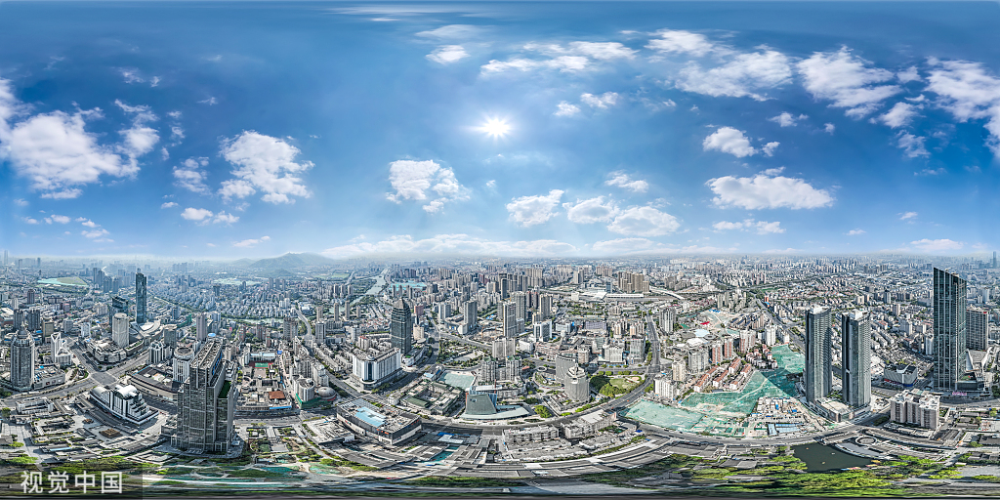
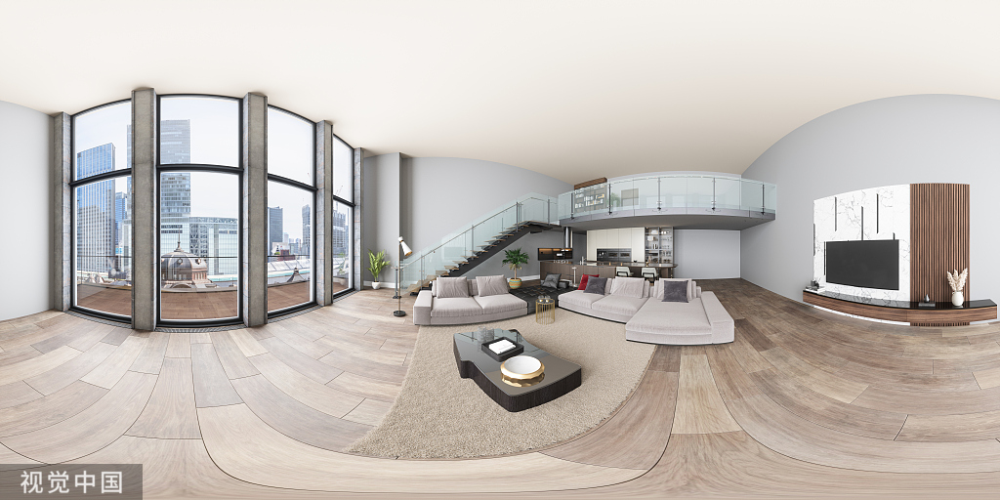
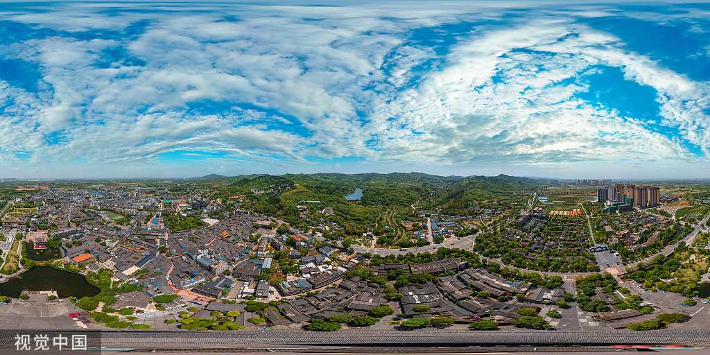

# 🌌 720 全景漫游平台

一个基于 Web 的 720° 全景图漫游创作与展示平台。用户可以上传全景图片，在场景中添加信息标记和跳转箭头，实现多房间之间的互动漫游体验。





---

## 📁 项目文件说明

### 🖥️ 后端服务

> **`server.js`** — Node.js + Express 后端 API 服务
>
> 提供图片上传、场景 CRUD、标记管理等 9 个 RESTful 接口，使用 MySQL 持久化存储

> **`package.json`** — 项目依赖配置
>
> 依赖：express · multer · cors · mysql2

### 🎨 前端页面

> **`index.html`** — 🏛️ 长廊主页
>
> 卡片瀑布流布局，展示所有已发布的全景作品，点击即可进入沉浸式漫游

> **`editor.html`** — ✏️ 全景创作工作台
>
> 上传主/副场景全景图，双击画面打点添加信息标记或场景跳转箭头，支持多房间切换编辑

> **`view.html`** — 👁️ 全景漫游体验
>
> 访客沉浸式浏览 720° 全景，点击 📍 查看信息，点击 ⬆️ 跳转至其他房间

> **`my.html`** — 👤 我的作品管理
>
> 基于 localStorage 记录创作历史，支持重新编辑和永久删除

### 🗄️ 数据库

> **`SQL`** — 建表脚本
>
> 包含 `scenes` 场景表 和 `markers` 热点标记表，MySQL InnoDB 引擎，utf8mb4 编码

### 🖼️ 示例素材

> **`城市.jpg`** · **`房子.jpg`** · **`村子.jpg`**
>
> 三张示例全景照片，开箱即用，上传后即可体验完整的漫游创作流程

---

## 🛠️ 技术栈

- 后端：Node.js + Express + MySQL
- 前端：原生 HTML/CSS/JS（无框架）
- 全景渲染：[Photo Sphere Viewer](https://photo-sphere-viewer.js.org/)（基于 Three.js）
- 文件上传：Multer
- 数据库驱动：mysql2

---

## 🚀 快速开始

**1. 安装依赖**

```bash
npm install
```

**2. 导入数据库（MySQL）**

```sql
CREATE DATABASE vr_pano;
USE vr_pano;
-- 然后执行 SQL 文件中的建表语句
```

**3. 修改数据库配置**

编辑 `server.js` 中的连接信息：

```js
const dbConfig = {
  host: '127.0.0.1',
  user: 'root',
  password: '你的密码',
  database: 'vr_pano'
};
```

**4. 启动服务**

```bash
npm start
```

**5. 打开浏览器访问**

```
http://localhost:3000
```

---

## 📡 API 接口一览

| 方法 | 路径 | 功能 |
|------|------|------|
| `POST` | `/api/upload` | 上传全景图片（支持主/副场景） |
| `GET` | `/api/scenes` | 获取所有主场景列表 |
| `GET` | `/api/scenes/:id` | 获取单个场景详情及其标记 |
| `GET` | `/api/scenes/:id/subs` | 获取主场景下的所有副场景 |
| `PUT` | `/api/scenes/:id` | 更新场景标题 |
| `POST` | `/api/scenes/:id/markers` | 添加热点标记 |
| `DELETE` | `/api/markers/:id` | 删除单个标记 |
| `POST` | `/api/my-scenes` | 根据 ID 列表获取我的作品 |
| `DELETE` | `/api/scenes/:id` | 删除场景（级联删除副场景、标记及文件） |

---


